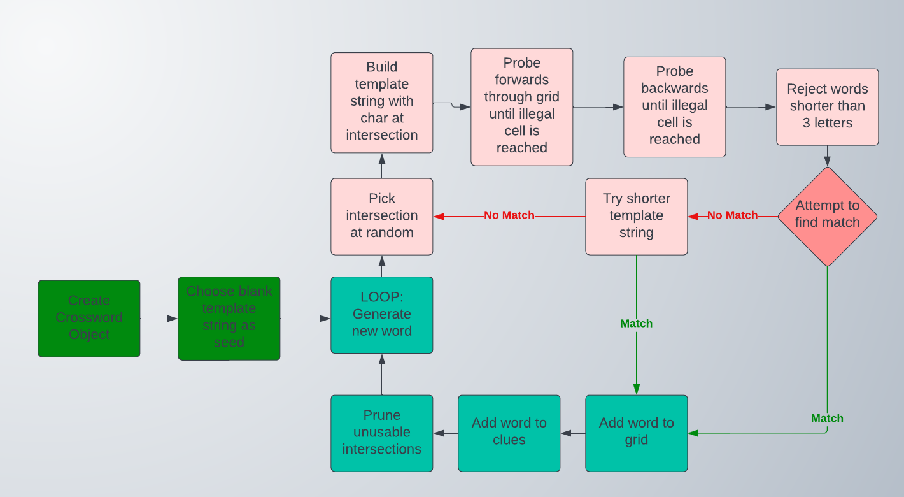
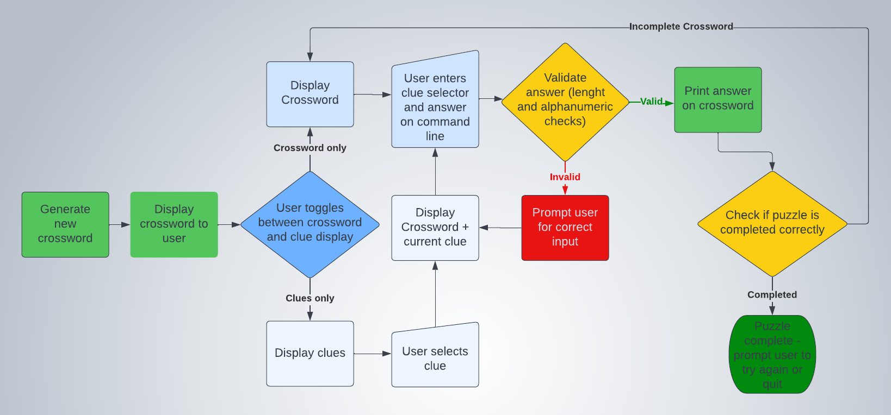

# Crossword-Generator

A python project that creates random crossword puzzles, and then allows the user to try 
to solve them using a command line interface.

## Screenshots

## How to play

## Features
- Random crossword generation, with different puzzle sizes possible.
- User entry of clue solutions on the crossword grid
- User selection of alternate clues when available

### Future Features
- A future extension of the project could involve the development of a GUI, ideally deployed to the web, where a user could request a generated crossword from the backend and then curate the clues, adding their own alternatives of greater or lesser difficulty, and asking the backend to find alternative words for particular positions in the crossword. The model of using dictionary definitions as clues does produce a usable result as a prototype, but keeping the difficulty and obscurity of the clues within a tight range that would be satisfying to the puzzle solver is probably best done by a human in the loop. 

## Development Process
There were two distinct development phases in this project, with the first phase involving the creation of a data source for generating the crossword puzzles. The process of assembling the data is outlined [here](DATA_PREPARATION.md). 

The second phase involved writing the code to generate the crossword, and allow the user to enter their guesses on the crossword grid.

## Data Model

The data assembled in the initial stage of development was saved to file in json format, to enable easy cross-platform future use and avoid tightly coupling the word dictionary to the particular code in this project.

Next, the json file was read into a format that could be used by the Python code. The imported data was organised into 2 python dictionaries. 
- The first was dict_by_length, which had as keys the set of all lengths of the words in the source data. The value for each key is a list containing all the words (as strings) of that length.
- The second was word_dict, which has as keys the set of all possible words. The value here for each was a list whose first element was the word frequency, and whose second element was a nested list of the possible definitions of that word.

An object-oriented approach was employed for the process of crossword generation. The concepts of Word, Clue, and Crossword were encapsulated in their own respective classes. The Crossword class is the most complex of these, as it is responsible for the task of generating legal crossword puzzles within a set of constraints.

## Execution Paths

## Testing
Four different testing approaches were used in the project:
- Manual testing
- Automated testing
- In-app testing
- User story testing

### Manual Testing
### Automated Testing
### In-app Testing
It is preferable for automated testing to be deterministic, i.e. for the same tests to be run on the code every time. So, in the automated testing, the same crosswords are used as fixtures each time. Because crosswords are usually generated randomly, it is possible that a given bug, dependent on a particular crossword layout, may not appear when the program is repeatedly tested against the pre-generated crosswords in automated testing.

For this reason, the project contains the python file `crossword_validation.py`, whose `validate(crossword)` method is invoked by `run.py` after a new random crossword is generated. This ensures that the crossword meets several requirements and is a valid crossword that can be solved by the user. The validator also has its own `main()` method, which generates 100 crosswords and validates each one in turn. This feature was included to mitigate the deterministic nature of the automated tests, and ensure that rare or difficult to reproduce bugs would be detectable.
### User Story Testing
### Bugs
#### Solved Bugs

A bug was found in the crossword generation algorithm, whereby a word could end up running into another word that already existed in the crossword, and ran in the same direction. This bug was only observed once in manual testing, and a screenshot was taken to enable analysis later. It turned out to be caused by an assumption that words would only intersect other words that ran orthogonal to themselves. This is almost always true, but it is possible for a word, for instance, to run down a column and collide with another that shares the same column. The last letter of the first could have been the first letter of the second, which turns them into one compound word

The bug was solved by checking that the orientation of the intersecting word was in fact orthogonal to the candidate word. This required the addition of another grid to the Crossword class, `Crossword.letter_use`, which recorded whether each letter in the grid was being used by an across word, a down word, both, or neither.

#### Remaining Bugs
### Validator Testing

## Deployment

## Credits
- Code Institute for the deployment terminal
- [Choose random enum from list](https://stackoverflow.com/questions/47353555/how-to-get-random-value-of-attribute-of-enum-on-each-iteration)