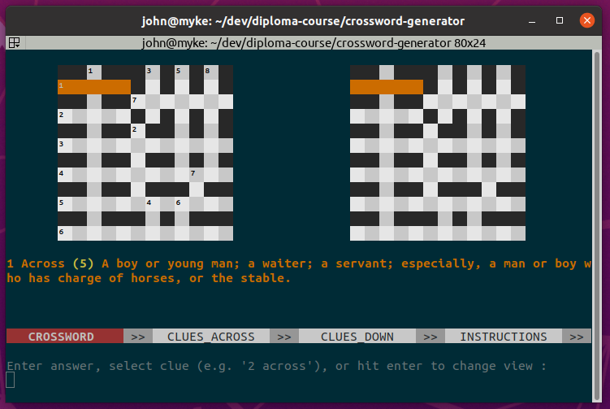
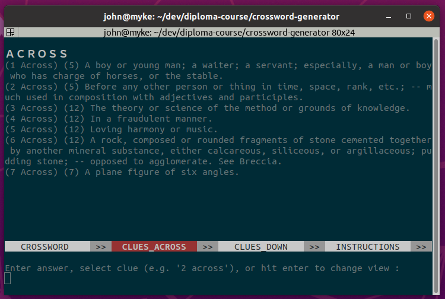
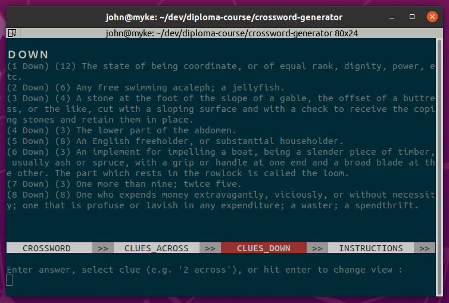
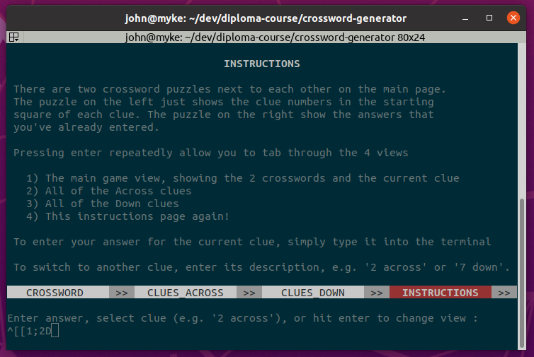
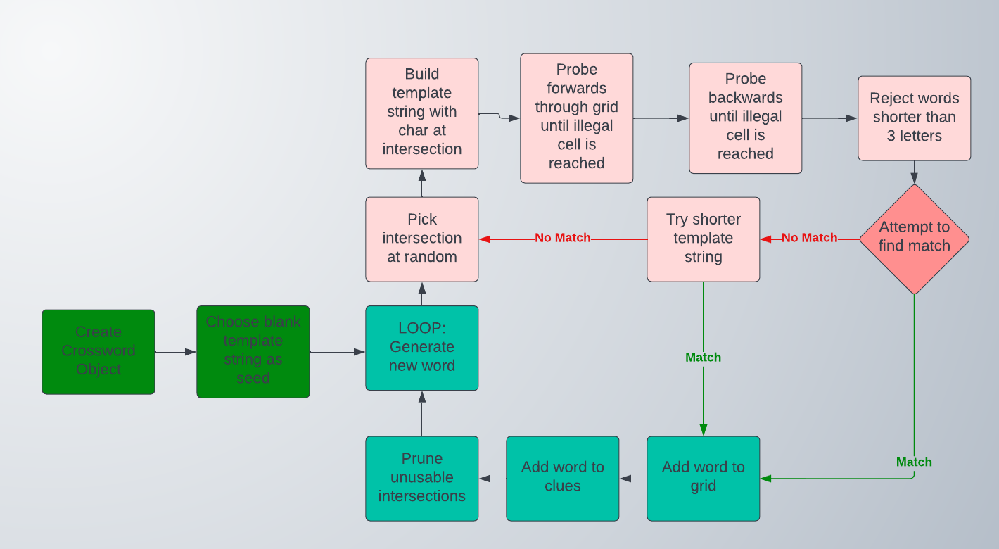
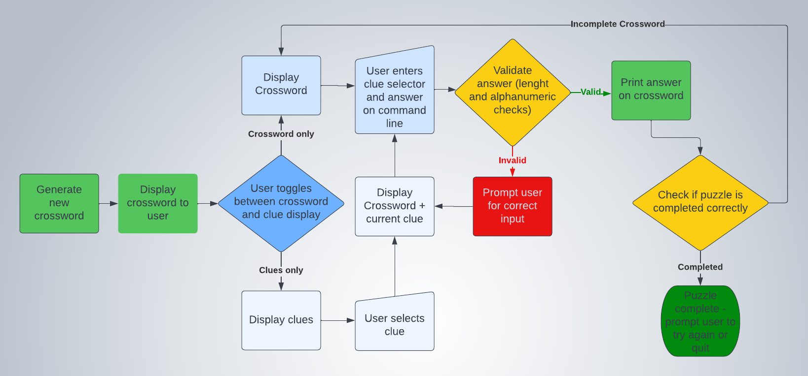

# Crossword Generator

A python project that creates random crossword puzzles, and then allows the user to try 
to solve them using a command line interface. The live project can be viewed [here](https://crossword-puzzle-p3.herokuapp.com/)

[Screenshots](#Screenshots)

[Features](#Features)

[User Experience](#User-Experience)

[Development Process](#Development-Process)

[Testing](#Testing)

[Bugs](#Bugs)

[Deployment](#Deployment)

[Credits](#Credits)

## Screenshots

[Return to top](#Crossword-Generator)

## Features
- Random crossword generation.
- User entry of clue solutions on the crossword grid
- User selection of alternate clues when available
- Validation of user input, with appropriate error messages

### Future Features
- A future extension of the project could involve the development of a GUI, ideally deployed to the web, where a user could request a generated crossword from the backend and then curate the clues, adding their own alternatives of greater or lesser difficulty, and asking the backend to find alternative words for particular positions in the crossword. The model of using dictionary definitions as clues does produce a usable result as a prototype, but keeping the difficulty and obscurity of the clues within a tight range that would be satisfying to the puzzle solver is probably best done by a human in the loop. 

[Return to top](#Crossword-Generator)
# User Experience

## User Stories
- #### First Time Visitor Goals
    - As a first-time visitor, I want to be able to quickly engage in the game, 
    - As a first-time visitor, I would like an easy, simple to use interface

- #### Returning Visitor Goals
    - As a returning visitor, I would like to be able to request an alternate clue when I am stuck.

## Design
The design of the program had to work within the constraints of an 80x24 terminal window, so layout of the crossword, clues and instructions was very important. I elected to display the crossword twice:
- The first view displays the empty layout and clue numbers, to act as a reference for the user.
- The second view displays the answers that the user has already input.

Beneath the 2 crossword views, the current clue is printed in orange text. This clue is also highlighted in orange on the 2 views.

Beneath the current clue, a horizontal bar names the four screens that it is possible to display, with the current screen's name highlighted in red:
- The normal puzzle view, with the 2 crosswords at the top of the display
- The Clues Across screen, listing all the clues that run horizontally in the puzzle at the same time.
- The Clues Down screen, listing the vertical clues.
- The Instructions screen, where the user can learn how to use the program. This screen is visible at the start.

Below the navigation bar, the prompt appears where the user can input their answers, highlight a different clue, or cycle through the 4 screens by pressing enter.

The navigation bar and the input prompt are common to all four screens, to ensure that the user has a consistent experience using the program.

[Return to top](#Crossword-Generator)

# Development Process
There were two distinct development phases in this project, with the first phase involving the creation of a data source for generating the crossword puzzles. The process of assembling the data is outlined [here](documentation/DATA_PREPARATION.md). 

The second phase involved writing the code to generate the crossword, and allow the user to enter their guesses on the crossword grid.

## Data Model
There are two independent aspects to the Data Model used:
1. The assembly of a dictionary of words; the raw material for the crossword generator
2. The internal structure of the Crossword class, and the Clue and Word classes that it employs
### 1: Dictionary containing words, frequencies and definitions
The data assembled in the initial stage of development was saved to file in json format, to enable easy 
cross-platform future use and avoid tightly coupling the word dictionary to the particular code in this 
project.

Next, the json file was read into a format that could be used by the Python code. The imported data 
was organised into 2 python dictionaries. 
- The first was word_length_map, which had as keys the set of all lengths of the words in the source data. The value for each key is a list containing all the words (as strings) of that length.
- The second was word_dict, which has as keys the set of all possible words. The value here for each was a list whose first element was the word frequency, and whose second element was a nested list of the possible definitions of that word.

An object-oriented approach was employed for the process of crossword generation. The concepts of Word, Clue, and Crossword were encapsulated in their own respective classes. The Crossword class is the most complex of these, as it is responsible for the task of generating legal crossword puzzles within a set of constraints.

### 2: Crossword, Clue and Word classes
-   The Crossword class is composed of the following data structures and elements.
    - `crossword.rows` The number of rows in the crossword.
    - `crossword.cols` The number of columns in the crossword.
    - `crossword.grid` A 2-dimensional array of characters, with values as follows.
    Unused squares are represented by a '_', and cells occupied by the letters
    of clues are contain those letters in lowercase.
    - `crossword.letter_use` A 2-dimensional array, matching grid (above) in size,
    which contains enum values of type LetterUse. This is used to indicate to the word
    generation algorithm whether existing clues are already using a cell in the horizontal
    or vertical direction, or both.
    - `crossword.user_guesses` Another 2-d array, matching grid in size, which contains
    the guesses that a user has entered.
    - `crossword.word_dict` A reference to the dictionary loaded from file in `run.py`, which 
    contains a list of all possible words, their frequencies, and their definitions.
    - `crossword.word_length_map` A reference to a python dictionary with word lengths as keys, and lists
    of words of that length as values, to enable a candidate word of known length to be 
    matched against dictionary words of the same length.
    - `crossword.clues_across` A list of the clues in the across (horizontal) direction.
    - `crossword.clues_down` A list of the clues in the down (vertical) direction.
    - `crossword.selected_clue` The clue currently selected by the user.

-   The Clue class is composed of these data structures and elements:
    - `clue.string` The characters that compose the clue's solution
    - `clue.index` The number assigned to the clue, used by the user for 
    identification.
    - `clue.orientation` The direction the clue string runs in.
    - `clue.definitions` A list of definitions of the word used, minimum 1
    - `clue.current_definition` The index of the current clue being displayed to
    the user. The user can cycle through the possible definitions by entering '?'
    repeatedly - this variable keeps track of which one is currently visible.
    - `clue.start_row` The row the clue word starts on.
    - `clue.start_col` The column the clue word starts on.

-   The Word class is composed of the follow data structures and elements
    - `word.orientation` The direction the word runs in
    - `word.string` The characters that make up the word
    - `word.start_row` The row the word starts on.
    - `word.start_col` The column the word starts on.

### Future improvements to the data structures used
It would be a good idea to simplify the code by removing `clue.string`, `clue.orientation`,
`clue.start_row` and `clue.start_col`, and replacing them with a single field of
type `Word`, which itself contains the same fields.

## Execution Paths

[Return to top](#Crossword-Generator)

# Testing
- Manual testing
- Automated testing
- In-app testing
- User story testing
- Validator testing

## Manual Testing
There are four types of user input possible:
1. Entering the answer to a clue, in the form of a single string of text of the correct length
2. Entering the description of a clue, ie '2 across', or '1 down'
3. Simply pressing enter without entering anything, to cycle through the available views
4. Entering a question mark, '?', cycles through the alternative definitions available, if any.

These were tested as follows:
1. Text answer to clues:
   - Tried entering an answer of the correct length, consisting only of letters - program displays the
   answer entered on the right-hand puzzle and responds with a confimation message at the 
   bottom of the screen.
   - Tried entering answers both too long and too short - program responds correctly with an error
   message informing the user of the mistake, and the expected length of the correct input.
   - Tried entering mixed alphabetical, numerical and punctuation characters - program responds correctly
   with the error message 'Solutions can only contain letters'
2. Clue specifier:
   - Tried entering the digit '1' followed by 'across' - program correctly displays this clue.
   - Tried entering just a digit alone, eg '3' - program correctly responds with an error message
   'Enter 3 followed by "down" or "across"'
   - Tried entering a clue that does not appear in the puzzle, eg '234 down' - program correctly 
   responds with the error message 'No clue matches 234 down!'
3. Cycling through views:
   - Tried pressing enter repeatedly - program displays each of the four possible views in turn.
4. Alternative definitions:
   - Tried entering a question mark - program correctly cycles through the available definitions, returning
   to the first when all have been shown once.
   - Tried entering a question mark on a clue with only one definition - program correctly responds with 
   the message - 'There's only one clue for that word!'
## Automated Testing
Automated testing was added using the pytest library. Due to time constraints, I concentrated on testing the functions
in the Crossword class, as these are the most opaque and hard to debug, given that they involve manipulation
of multi-dimensional arrays. The tests were written after the code was completed, and it was clear that I 
could have saved a lot of time had I written the tests along with the code, rather than debugging the code
based on the outputted crosswords. I intend to test along with writing the code in the remaining projects.
## In-app Testing
It is preferable for automated testing to be deterministic, i.e. for the same tests to be run on the code every time. So, in the automated testing, the same crosswords are used as fixtures each time. Because crosswords are usually generated randomly, it is possible that a given bug, dependent on a particular crossword layout, may not appear when the program is repeatedly tested against the pre-generated crosswords in automated testing.

For this reason, the project contains the python file `crossword_validation.py`, whose `validate(crossword)` method is invoked by `run.py` after a new random crossword is generated. This ensures that the crossword meets several requirements and is a valid crossword that can be solved by the user. The validator can also be run from the command line, using the command `python3 validation_repeated.py`, which generates 100 crosswords and validates each one in turn. This feature was included to mitigate the deterministic nature of the automated tests, and ensure that rare or difficult to reproduce bugs would be detectable.
## User Story Testing
- #### First Time Visitor Goals
    - *As a first-time visitor, I want to be able to quickly engage in the game.*
    The game loads quickly, and after a brief animation of the crossword being created, the user is taken immediately to the instructions screen. From here, one tap of the enter button and the user is trying to solve the puzzle.
    
    - *As a first-time visitor, I would like an easy, simple to use interface.*
    There are only 3 types of command possible - entering an answer, switching to a different clue, and cycling through the 4 display screens. This enables the user to navigate through a considerable quantity of information (presented in a very small space) easily and intuitively.

- #### Returning Visitor Goals
    - *As a returning visitor, I would like to be able to request an alternate clue when I am stuck.* 
    Entering a question mark will present the user with all of the alternative definitions of the word that exist, or inform them if there is only one.
## Validator Testing
All python files pass online PEP8 validation, with the exception of test_crossword_generator.py, 
which fails only on line lengths. I would argue that these failures are acceptable
due to the importance of having expressive method names for the tests.

[Return to top](#Crossword-Generator)

# Bugs
## Solved Bugs

A bug was found in the crossword generation algorithm, whereby a word could end up running into another word that already existed in the crossword, and ran in the same direction. This bug was only observed once in manual testing, and a screenshot was taken to enable analysis later. It turned out to be caused by an assumption that words would only intersect other words that ran orthogonal to themselves. This is almost always true, but it is possible for a word, for instance, to run down a column and collide with another that shares the same column. The last letter of the first could have been the first letter of the second, which turns them into one compound word

The bug was solved by checking that the orientation of the intersecting word was in fact orthogonal to the candidate word. This required the addition of another grid to the Crossword class, `Crossword.letter_use`, which recorded whether each letter in the grid was being used by an across word, a down word, both, or neither.

## Remaining Bugs
There are no outstanding bugs in the project. 

[Return to top](#Crossword-Generator)

## Libraries and Programs Used
1. [Lucid](https://www.lucidchart.com/pages/)
    - Lucid charts were used to create the execution path diagrams.
2. [Heroku](https://www.heroku.com/)
    - Heroku was used to deploy the project
3. [Git](https://git-scm.com/)
    - Version control was implemented using Git through the Github terminal.
4. [Github](https://github.com/)
    - Github was used to store the projects after being pushed from Git and its cloud service [Github Pages](https://pages.github.com/) was used to serve the project on the web.
5. [Visual Studio Code](https://code.visualstudio.com/)
    - VS Code was used locally as the main IDE environment, primarily because it was easier to set up a development environment locally than in GitPod (I wasn't sure how to persist the Jest installation across different GitPod sessions)
6. [PyCharm-Community](https://www.jetbrains.com/pycharm/)
    - I switched to PyCharm towards the end of the project, as it has better support for PEP8 compliance.
7. [pytest](https://docs.pytest.org/en/7.1.x/)
    - Pytest was used for automated testing.

## Deployment
The project was deployed using Code Institute's mock terminal for Heroku. In order to deploy the project
yourself, you can follow this procedure:
- Clone this repository using the following command
    - `git clone 'https://github.com/johnrearden/crossword-generator.git'`
- Create a new Heroku app
- Set the buildpacks to Python and NodeJS (order is important)
- Link your Heroku app to the repository
- Click on `DEPLOY`

[Return to top](#Crossword-Generator)

## Credits
- Code Institute for the deployment terminal
- [Choose random enum from list](https://stackoverflow.com/questions/47353555/how-to-get-random-value-of-attribute-of-enum-on-each-iteration)
- collections.defaultdict : Recommended by my mentor, Celestine Okoro.
- [Remove extra whitespace characters from string](https://statisticsglobe.com/python-remove-whitespace-in-string)

[Return to top](#Crossword-Generator)